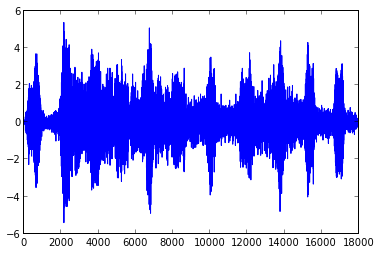

Density Transformations & ICA
=============================

6.1 Density Transformations
===========================

Since

.. math::  f(x)dx = f(x(u)) \mid det \frac {\partial x(u)}{\partial u}\mid du 

.. math:: u = u(x) = e ^{-x} 

.. math:: P_x(x) = f(x) = e^{-x}

.. math:: P_u(u) = f(x(u))\mid det \frac {\partial x(u)}{\partial u}\mid

Thereforce

.. math::  x = -\ln{u} 

.. math:: P_u(u) = x  * \mid -\frac{1}{x} \mid = 1 

6.2 Random Number Generation
============================

Since

.. math:: F(x)=\int_{-\infty}^x p(x) dx = \int_{-infty}^x \frac{1}{2b}e^{-\frac{|x-u|}{b}}dx 

 We get

.. math::

   z=F(x)=
   \begin{cases} 1/2e^{-\frac{u-x}{b}} & x \le u \\\\ 
   1-\frac{1}{2}e^{-\frac{x-u}{b}} & x > u
   \end{cases}

 Thereforce

.. math::

    x = F^{-1}(z) = 
   \begin{cases} u+b\ln (2z) & 0 \le z \le \frac{1}{2} \\\\
   u-b\ln (2-2z) & \frac{1}{2} < z \le 1
   \end{cases}

the random variable :math:`z=F(x)` is uniformly distributed on the
interval [0,1]

In[34]:

.. code:: python

    import matplotlib.pyplot as plt
    #data generation with the formula above
    u = 1
    b = 1
    size = 500
    vectorX = [0 for i in range(size)]
    z = random.uniform(0,1,size)
    for i in range(500):
        if(z[i] > 0.5):
            vectorX[i] = u - b*math.log(2-2*z[i])
        else:
            vectorX[i] = u + b*math.log(2*z[i])
    
    plt.clf()
    plt.hist(z, bins=50, color='blue')
    plt.title('histogram of generated Variable Z')
    plt.show()
    
    plt.clf()
    plt.hist(vectorX, bins=50, color='blue')
    plt.title('histogram of generated Variable X')
    plt.show()
    
    
    vectorL = random.laplace(1,1,size)
    plt.hist(vectorL, bins=50, color='blue')
    plt.title('histogram of Laplace Variable L')
    plt.show()

6.3 ICA
=======

Initialization
--------------

In[10]:

.. code:: python

    from numpy import *
    import random
    
    #read data from pca2.csv
    data01 = loadtxt('sounds/sound1.dat', unpack = True )
    data02 = loadtxt('sounds/sound2.dat', unpack = True )
    source = matrix([data01,data02])
    length = source.shape[1]
    
    #generate .wav files
    import scipy.io.wavfile
    def plotVoice(dataMatrix):
        length = dataMatrix.shape[1]
        fig1 = plt.figure(1)
        fig2 = plt.figure(2)
        ax1 = fig1.add_subplot(111)
        ax2 = fig2.add_subplot(111)
        ax1.plot(matrix.getA1(dataMatrix[0,:]))
        ax2.plot(matrix.getA1(dataMatrix[1,:]))
        plt.show()
    
    def fileWriter(dataMatrix, file1, file2):
        normsig1 = asarray((2**16)*matrix.getA1(dataMatrix[0,:])/(max(matrix.getA1(dataMatrix[0,:]))-min(matrix.getA1(dataMatrix[0,:]))),int16) ## normalize before writing
        normsig2 = asarray((2**16)*matrix.getA1(dataMatrix[1,:])/(max(matrix.getA1(dataMatrix[1,:]))-min(matrix.getA1(dataMatrix[1,:]))),int16) ## normalize before writing
        scipy.io.wavfile.write(file1,8192,normsig1)
        scipy.io.wavfile.write(file2,8129,normsig2)
        
    plotVoice(source)
    fileWriter(source,'source1.wav','source2.wav')
        

In[11]:

.. code:: python

    #create a random mixing matrix A and mix the sources: x = As
    random.seed(100)
    A = matrix([[random.random(),random.random()],[random.random(),random.random()]])
    print "Matrix A is:"
    print A
    mix = A * source
    
    plotVoice(mix)
    fileWriter(mix,'mix1.wav','mix2.wav')
    

.. parsed-literal::

    Matrix A is:
    [[ 0.14566926  0.454927  ]
     [ 0.77078381  0.70551323]]

.. image:: Exercise_6_files/Exercise_6_fig_05.png

In[12]:

.. code:: python

    #permute the columns of N x p data matrix mix randomly
    tmpCol = matrix([[0],[0]])
    for i in range (length):
        colNo = random.randint(0, length-1)
        tmpCol = mix[:,colNo]
        mix[:,colNo] = mix[:,i]
        mix[:,i] = tmpCol
        
    plotVoice(mix)
    fileWriter(mix,'mix_per1.wav','mix_per2.wav')

In[13]:

.. code:: python

    #Calculate the correlations between the sources and the mixtures
    correlation = matrix([[0.],[0.]])
    correlation[0,0] = corrcoef([source[0,i] for i in range (length)] , [mix[0,j] for j in range (length)])[0,1]
    correlation[1,0] = corrcoef([source[1,i] for i in range (length)] , [mix[1,j] for j in range (length)])[0,1]    
    print "Correlation between S and X:"
    print correlation

.. parsed-literal::

    Correlation between S and X:
    [[ 0.11071182]
     [ 0.24131383]]

In[14]:

.. code:: python

    #center the data to zero man
    X = matrix([data01,data02])
    for i in range (length):
        X[:,i] = mix[:,i] - mix.mean(1) 
        
    #initialize the unmixing matrix W with random values
    def init_W():
        random.seed(200)
        W = matrix([[random.random(), random.random()],[random.random(),random.random()]])
        return W

Optimization
------------

.. math:: f(x) = \frac{1}{1+e ^{-x}} 

.. math:: f'(x) = f(x) * (1 - f(x)) 

.. math::  f''(x) = f'(x) - 2f'(x)f(x) 

In[15]:

.. code:: python

    #function f(x)
    def f(x):
        return 1/(1+ math.exp(-x))
    
    #function f''(x)/f'(x)
    def fi(x):
        return 1 - 2*f(x)
    
    #nomalization for matrix
    def normalMatrix(m):
        for i in range(m.shape[0]):
            tmp = 0.
            for j in range(m.shape[1]):
                tmp += m[i,j] ** 2
            tmp = math.sqrt(tmp)
            for j in range(m.shape[1]):
                m[i,j] /= tmp

a.) Gradient Ascent
~~~~~~~~~~~~~~~~~~~

In[16]:

.. code:: python

    W = init_W()
    print "Init-Matrix W: "
    print W
    iteration = length * 1
    rate_init =0.5
    
    delta_W = matrix([[0.,0.],[0.,0.]])
    plot_DW = []
    for t in range(1 , iteration):
        alpha = t % length
        rate = rate_init / t  
        for i in range(2):
            sum_WikXk = 0.
            for k in range(2):
                sum_WikXk += W[i,k] * X[k,alpha]
            for j in range(2):
                inverse = W.getI()
                delta_W[i,j] = rate * ( inverse[j,i] + fi(sum_WikXk) * X[j,alpha] ) 
        W = W + delta_W 
        if(t % 1000 == 0):
            tmp = delta_W[0,0]**2 + delta_W[1,1]**2 + delta_W[0,1]**2 + delta_W[1,0]**2
            plot_DW.append(tmp)
        #print W
    print "matrix W is:"
    print W
    print "after normalization:"
    normalMatrix(W)
    print W

.. parsed-literal::

    Init-Matrix W: 
    [[ 0.0456093   0.20344697]
     [ 0.70912398  0.1428485 ]]
    matrix W is:

.. parsed-literal::

    
    [[-1.23568822  2.24189833]
     [ 2.88958884 -0.50818057]]
    after normalization:
    [[-0.48271158  0.87577939]
     [ 0.98488529 -0.17320788]]

In[17]:

.. code:: python

    #recovery
    ds = W * source
    
    plotVoice(ds)
    fileWriter(ds, 'recovery1.wav', 'recovery2.wav')

In[21]:

.. code:: python

    #Calculate the correlations between the true sources and the estimations
    correlation = matrix([[0.],[0.]])
    correlation[0,0] = corrcoef([source[0,i] for i in range (length)] , [ds[1,j] for j in range (length)])[0,1]
    correlation[1,0] = corrcoef([source[1,i] for i in range (length)] , [ds[0,j] for j in range (length)])[0,1]    
    print "Correlation between the true sources and the estimations:"
    print correlation

.. parsed-literal::

    Correlation between S and X:
    [[ 0.98486963]
     [ 0.87570078]]

In[22]:

.. code:: python

    #plot delta_W
    fig = plt.figure()
    ax = fig.add_subplot(111)
    ax.set_xlabel('per 1000th update')
    ax.plot([i+1 for i in range(len(plot_DW))],plot_DW)
    plt.show()

In[31]:

.. code:: python

    #Plot the density of the mixed, unmixed, and true signals.
    ax=plt.subplot(321)
    ax.hist(matrix.getA1(source[0,:]), bins=50, color='blue')
    ax.set_title('histogram of 1st source')
    
    ax=plt.subplot(322)
    ax.hist(matrix.getA1(source[1,:]), bins=50, color='red')
    ax.set_title('histogram of 2nd source')
    
    ax=plt.subplot(323)
    ax.hist(matrix.getA1(mix[0,:]), bins=50, color='blue')
    ax.set_title('histogram of 1st mix')
    
    ax=plt.subplot(324)
    ax.hist(matrix.getA1(mix[1,:]), bins=50, color='red')
    ax.set_title('histogram of 2st mix')
    
    ax=plt.subplot(325)
    ax.hist(matrix.getA1(ds[0,:]), bins=50, color='red')
    ax.set_title('histogram of 1st ummix')
    
    ax=plt.subplot(326)
    ax.hist(matrix.getA1(ds[1,:]), bins=50, color='blue')
    ax.set_title('histogram of 2nd unmix')
    
    plt.show()

b.) Natural Gradient
~~~~~~~~~~~~~~~~~~~~

In[33]:

.. code:: python

    W = init_W()
    print "Init-Matrix W: "
    print W
    iteration = length * 1
    rate_init =0.5
    
    delta_W = matrix([[0.,0.],[0.,0.]])
    plot_DW_natural = []
    for t in range(1 , iteration):
        alpha = t % length
        rate = rate_init / t  
        for i in range(2):
            sum_WikXk = 0.
            for k in range(2):
                sum_WikXk += W[i,k] * X[k,alpha]
            for j in range(2):
                sum_Wlj = 0
                for l in range(2):
                    if (l == i):
                        continue
                    sum_WlkXk = 0
                    for k in range (2):
                        sum_WlkXk += W[l,k] * X[k,alpha]
                    sum_Wlj += sum_WlkXk
            delta_W[i,j] = rate * fi(sum_WikXk) * sum_Wlj
        W = W + delta_W 
        if(t % 1000 == 0):
            tmp = delta_W[0,0]**2 + delta_W[1,1]**2 + delta_W[0,1]**2 + delta_W[1,0]**2
            plot_DW_natural.append(tmp)
        #print W
    print "matrix W is:"
    print W
    print "after normalization:"
    normalMatrix(W)
    print W

.. parsed-literal::

    Init-Matrix W: 
    [[ 0.0456093   0.20344697]
     [ 0.70912398  0.1428485 ]]
    matrix W is:

.. parsed-literal::

    
    [[ 0.0456093   0.08026234]
     [ 0.70912398  0.02462701]]
    after normalization:
    [[ 0.4940561   0.86943003]
     [ 0.9993975   0.03470785]]

In[34]:

.. code:: python

    #recovery
    ds_natrual = W * source
    
    plotVoice(ds_natrual)
    fileWriter(ds_natrual, 'recovery_natual1.wav', 'recovery_natural2.wav')

In[36]:

.. code:: python

    #Calculate the correlations between the true sources and the estimations
    correlation_natural = matrix([[0.],[0.]])
    correlation_natural[0,0] = corrcoef([source[0,i] for i in range (length)] , [ds_natrual[1,j] for j in range (length)])[0,1]
    correlation_natural[1,0] = corrcoef([source[1,i] for i in range (length)] , [ds_natrual[0,j] for j in range (length)])[0,1]    
    print "Correlation between the true sources and the estimations:"
    print correlation_natural

.. parsed-literal::

    Correlation between the true sources and the estimations:
    [[ 0.99939718]
     [ 0.86964748]]

In[37]:

.. code:: python

    #plot delta_W_natural
    fig = plt.figure()
    ax = fig.add_subplot(111)
    ax.set_xlabel('natural gradient--per 1000th update')
    ax.plot([i+1 for i in range(len(plot_DW_natural))],plot_DW_natural)
    plt.show()

In[38]:

.. code:: python

    #Plot the density of the mixed, unmixed, and true signals.
    ax=plt.subplot(321)
    ax.hist(matrix.getA1(source[0,:]), bins=50, color='blue')
    ax.set_title('histogram of 1st source')
    
    ax=plt.subplot(322)
    ax.hist(matrix.getA1(source[1,:]), bins=50, color='red')
    ax.set_title('histogram of 2nd source')
    
    ax=plt.subplot(323)
    ax.hist(matrix.getA1(mix[0,:]), bins=50, color='blue')
    ax.set_title('histogram of 1st mix')
    
    ax=plt.subplot(324)
    ax.hist(matrix.getA1(mix[1,:]), bins=50, color='red')
    ax.set_title('histogram of 2st mix')
    
    ax=plt.subplot(325)
    ax.hist(matrix.getA1(ds_natrual[0,:]), bins=50, color='red')
    ax.set_title('histogram of 1st ummix')
    
    ax=plt.subplot(326)
    ax.hist(matrix.getA1(ds_natrual[1,:]), bins=50, color='blue')
    ax.set_title('histogram of 2nd unmix')
    
    plt.show()

Comparison of two learning methods
~~~~~~~~~~~~~~~~~~~~~~~~~~~~~~~~~~

In[44]:

.. code:: python

    ax=plt.subplot(211)
    ax.set_title('regular gradient')
    ax.plot([i+1 for i in range(len(plot_DW))],plot_DW)
    
    ax=plt.subplot(212)
    ax.set_title('natrual gradient')
    ax.plot([i+1 for i in range(len(plot_DW_natural))],plot_DW_natural)
    plt.show()

As we can see from the figure above, the natural gradient can get a
convergence point much faster.

Comparison after whitening the Data
~~~~~~~~~~~~~~~~~~~~~~~~~~~~~~~~~~~

In[78]:

.. code:: python

    #function to get the covariance matrix
    def get_CoMatrix(data, dimension):
        C = [[0. for i in range(dimension)] for j in range(dimension)]
        p = data.shape[1]
        m = mix.mean(1)
        for i in range(dimension):
            for j in range(dimension):
                for a in range(p):
                    C[i][j] += ( (data[i,a] - m[i,0]) * (data[j,a] - m[j,0]) )/p
        return C
    
    #function to get eigenvalues and eigenvectors
    def get_PC(data, dimension, nume):
        C = get_CoMatrix(data, dimension)   
        if nume == dimension:
            evals, evecs = np.linalg.eig(asmatrix(C))
        else:
            evals, evecs = sp.sparse.linalg.eigs(asmatrix(C), k = nume)
        return evals, evecs
    
    evals, evecs = get_PC(X, 2, 2)
    print evals
    print evecs
    E = matrix(evecs)
    Dd = matrix(np.diag([ 1/math.sqrt(evals[i]) for i in range(2)]))
    Z =(( X.T * E) * Dd).T
    print 'after whitening:'
    print Z

.. parsed-literal::

    [ 0.05006899  1.35363586]
    [[-0.92229698 -0.38648192]
     [ 0.38648192 -0.92229698]]
    after whitening:
    [[ 0.01834547  0.01844986  0.26840202 ..., -0.61824489  0.01844411
       0.01834547]
     [-0.00210848 -0.00199554  0.19219774 ...,  0.65723508  0.00203564
      -0.00210848]]

a.do Regular gradient with whitened data

In[79]:

.. code:: python

    W = init_W()
    print "Init-Matrix W: "
    print W
    iteration = length * 1
    rate_init =0.5
    
    delta_W = matrix([[0.,0.],[0.,0.]])
    plot_DW = []
    for t in range(1 , iteration):
        alpha = t % length
        rate = rate_init / t  
        for i in range(2):
            sum_WikXk = 0.
            for k in range(2):
                sum_WikXk += W[i,k] * Z[k,alpha]
            for j in range(2):
                inverse = W.getI()
                delta_W[i,j] = rate * ( inverse[j,i] + fi(sum_WikXk) * Z[j,alpha] ) 
        W = W + delta_W 
        if(t % 1000 == 0):
            tmp = delta_W[0,0]**2 + delta_W[1,1]**2 + delta_W[0,1]**2 + delta_W[1,0]**2
            plot_DW.append(tmp)
        #print W
    print "matrix W is:"
    print W
    print "after normalization:"
    normalMatrix(W)
    print W

.. parsed-literal::

    Init-Matrix W: 
    [[ 0.0456093   0.20344697]
     [ 0.70912398  0.1428485 ]]
    matrix W is:

.. parsed-literal::

    
    [[-0.16409082  2.23398162]
     [ 1.78681701  0.03664664]]
    after normalization:
    [[-0.07325483  0.99731326]
     [ 0.99978975  0.02050514]]

b.do Natural gradient with whitened data

In[83]:

.. code:: python

    W = init_W()
    print "Init-Matrix W: "
    print W
    iteration = length * 1
    rate_init =0.5
    
    delta_W = matrix([[0.,0.],[0.,0.]])
    plot_DW_natural = []
    for t in range(1 , iteration):
        alpha = t % length
        rate = rate_init / t  
        for i in range(2):
            sum_WikXk = 0.
            for k in range(2):
                sum_WikXk += W[i,k] * Z[k,alpha]
            for j in range(2):
                sum_Wlj = 0
                for l in range(2):
                    if (l == i):
                        continue
                    sum_WlkXk = 0
                    for k in range (2):
                        sum_WlkXk += W[l,k] * Z[k,alpha]
                    sum_Wlj += sum_WlkXk
            delta_W[i,j] = rate * fi(sum_WikXk) * sum_Wlj
        W = W + delta_W 
        if(t % 1000 == 0):
            tmp = delta_W[0,0]**2 + delta_W[1,1]**2 + delta_W[0,1]**2 + delta_W[1,0]**2
            plot_DW_natural.append(tmp)
        #print W
    print "matrix W is:"
    print W
    print "after normalization:"
    normalMatrix(W)
    print W

.. parsed-literal::

    Init-Matrix W: 
    [[ 0.0456093   0.20344697]
     [ 0.70912398  0.1428485 ]]
    matrix W is:

.. parsed-literal::

    
    [[ 0.0456093   0.08508957]
     [ 0.70912398  0.03919878]]
    after normalization:
    [[ 0.47242747  0.88136955]
     [ 0.99847568  0.05519349]]

In[84]:

.. code:: python

    ax=plt.subplot(211)
    ax.set_title('regular gradient')
    ax.plot([i+1 for i in range(len(plot_DW))],plot_DW)
    
    ax=plt.subplot(212)
    ax.set_title('natrual gradient')
    ax.plot([i+1 for i in range(len(plot_DW_natural))],plot_DW_natural)
    plt.show()

As we can see, after data whitening, the natural gradient takes much
longer time to get the convergence, while the convergence speed of
regular gradient stays the same.
